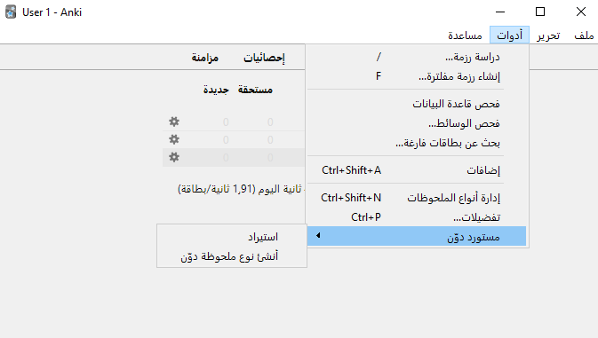

## مستورد تطبيق دوّن لبرنامج أنكي

هذه إضافة تجريبية لاستيراد تدوينات [تطبيق دوّن](https://twitter.com/dawwenapp/) إلى [برنامج أنكي](https://apps.ankiweb.net/).

استخدم أدوات < مستورد دوّن < استيراد لاستيراد ملف مصدّر من تطبيق دوّن.
تنشئ الإضافة نوع ملحوظة مخصصًا لتدوينات دوّن في أول مرة تستخدمها فيها تلقائيًا.
كما يمكنك استخدام زر «أنشئ نوع ملحوظة دوّن» لإنشاء نوع ملحوظة يدويًا.

